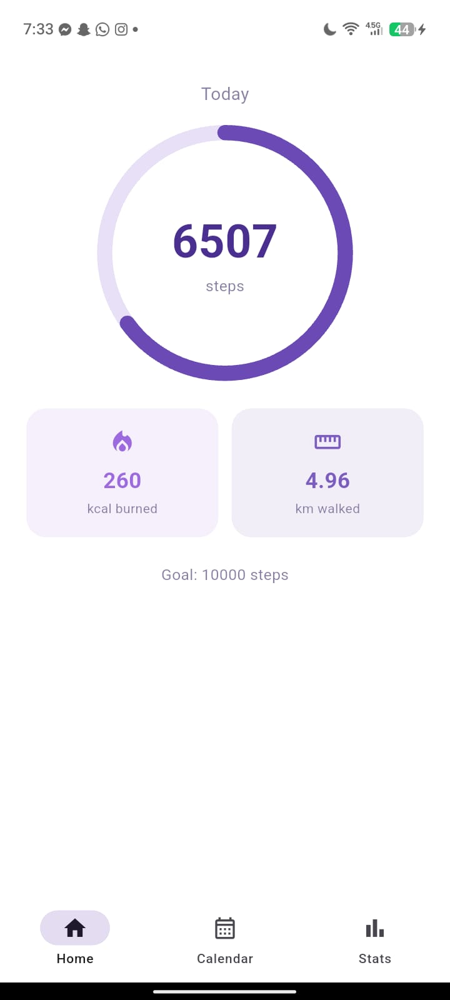
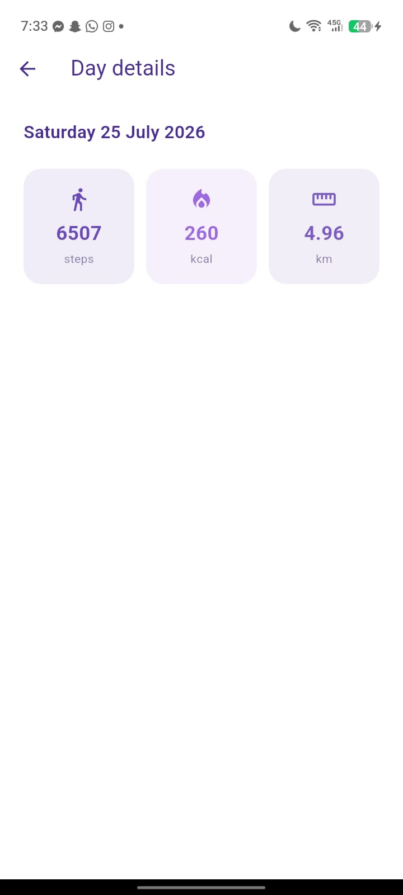
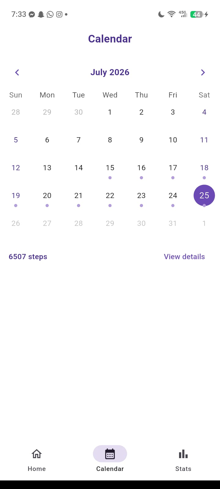
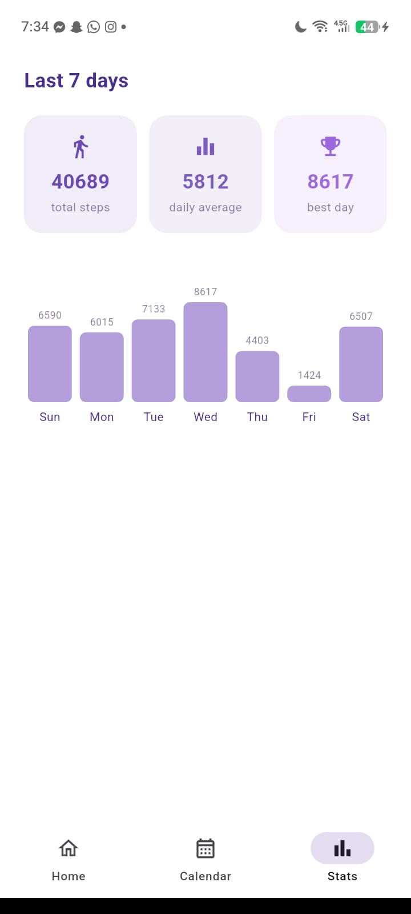
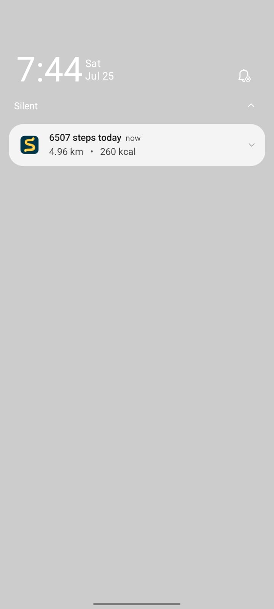

<div align="center">

# 👣 Step Tracker

### A clean, offline-first step counter for Android — built with Flutter

Counts your steps in the background, keeps a live notification with your stats,
celebrates every 1000-step milestone, and gives you a calendar to look back on.


</div>

<br>

## 📱 Screenshots

<div align="center">
<table>
  <tr>
    <td align="center" width="25%">
      <br>
      <sub><b>Home</b></sub>
    </td>
    <td align="center" width="25%">
      <br>
      <sub><b>Day details</b></sub>
    </td>
    <td align="center" width="25%">
      <br>
      <sub><b>Calendar </b></sub>
    </td>
  </tr>
  <tr>
    <td align="center" width="25%">
      <br>
      <sub><b>Statistics</b></sub>
    </td>
    <td align="center" width="25%">
      <br>
      <sub><b>Notification</b></sub>
    </td>
  </tr>
</table>
</div>

<br>

## ✨ Features

- 🚶 **Automatic step counting** using the phone's built‑in step sensor
- 🔄 **Keeps counting when the app is closed**, via an Android foreground service
- 🔔 **Live notification** showing today's steps, distance (km) and calories burned
- 🎉 **Milestone celebrations** — a congratulation notification every 1,000 steps
- 📅 **Interactive calendar** — tap any day to see its stats
- 📊 **7-day statistics** with a simple, glanceable bar chart
- 📡 **Fully offline** — everything is stored locally on your device, no account, no server
- 🎨 **Clean white & purple UI**, no clutter

<br>

## 🛠️ Built with

| Purpose | Package |
|---|---|
| Step sensor | [`pedometer`](https://pub.dev/packages/pedometer) |
| Background execution | [`flutter_background_service`](https://pub.dev/packages/flutter_background_service) |
| Notifications | [`flutter_local_notifications`](https://pub.dev/packages/flutter_local_notifications) |
| Local storage | [`shared_preferences`](https://pub.dev/packages/shared_preferences) |
| Calendar UI | [`table_calendar`](https://pub.dev/packages/table_calendar) |
| Permissions | [`permission_handler`](https://pub.dev/packages/permission_handler) |

<br>

## ⚠️ Platform note

Background step counting with a live-updating notification is an **Android-only**
capability — it relies on Android's foreground service model. iOS does not allow
apps to run a persistent background service or keep a notification live-updating
while closed, so on iOS the app refreshes its stats when opened or resumed
instead of continuously in the background. This is an OS-level restriction from
Apple, not a limitation of this codebase.

<br>

## 🚀 Getting started

### Prerequisites

- [Flutter SDK](https://docs.flutter.dev/get-started/install) installed
- A physical Android device (most emulators don't emit real step sensor events)

### Setup

```bash
# 1. Clone the repo
git clone https://github.com/<your-username>/step-tracker.git
cd step-tracker

# 2. Generate the native Android/iOS project files
flutter create .

# 3. Merge the manifest permissions and service overrides
#    from android_manifest_additions.xml into
#    android/app/src/main/AndroidManifest.xml

# 4. Enable core library desugaring in android/app/build.gradle.kts
#    (required by flutter_local_notifications) — see comments in that file

# 5. Install dependencies
flutter pub get

# 6. Run on a connected device
flutter run
```

On first launch, grant the **Physical activity** and **Notifications**
permissions, and when prompted about battery optimization, choose
**"Allow" / "Don't optimize"** so the OS doesn't kill the background service.

<br>

## 📂 Project structure

```
lib/
├── constants.dart                    # step→km / step→calorie formulas, color palette
├── models/
│   └── daily_steps.dart              # one day's step record
├── services/
│   ├── storage_service.dart          # local daily history (SharedPreferences)
│   ├── notification_service.dart     # live stats + milestone notifications
│   └── background_step_service.dart  # foreground service + pedometer listener
├── screens/
│   ├── home_screen.dart              # today's ring, km, calories
│   ├── calendar_screen.dart          # tappable calendar of tracked days
│   ├── details_screen.dart           # one day's steps/km/calories
│   └── stats_screen.dart             # 7-day totals, average, bar chart
├── widgets/
│   └── stat_card.dart                # shared stat tile
└── main.dart                         # permissions, service startup, navigation
```


<br>

## 🤝 Contributing

Issues and pull requests are welcome. If you spot a bug or have an idea,
feel free to open an issue.

## 📄 License

This project is licensed under the MIT License — see the
[LICENSE](LICENSE) file for details.

<br>

<div align="center">
<sub>Made with 💜 and Flutter</sub>
</div>


---

## 👤 Author

**Ghofrane BM**
Flutter Developer
📍 Tunisia 🇹🇳

---

## ⭐ Support

If you like this project, feel free to **star ⭐ the repository**
and follow my Flutter learning journey!
